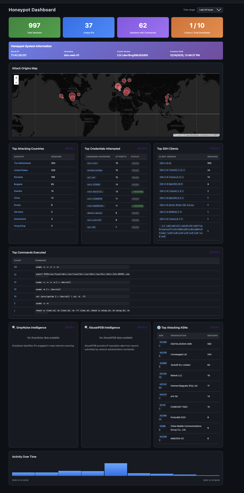

# Cowrie Deploy Toolkit

Deploy realistic [Cowrie](https://github.com/cowrie/cowrie) SSH honeypots on Hetzner Cloud with anti-fingerprinting features.

## Features

- **Realistic filesystem** - Captures actual Debian filesystem with WordPress, MySQL, and services
- **Anti-fingerprinting** - Removes all traces of Cowrie from the snapshot
- **IP-locked authentication** - IPs locked to first successful credentials for enhanced realism
- **Authentic identity** - Uses real SSH banner, kernel version, process list, and system files
- **Automated deployment** - Single script deploys a production-ready honeypot
- **Daily threat reports** - GeoIP (with ASN), VirusTotal, YARA scanning with automated email delivery
- **Web dashboard** - Session playback with asciinema-player, live attack map, malware browser, system info
- **Threat intelligence** - AbuseIPDB IP reputation, DShield data sharing, GreyNoise integration
- **Canary tokens** - Optional honeytokens for immediate exfiltration alerts
- **Tailscale VPN** - Zero-trust management access with optional public SSH blocking
- **Security hardening** - Automatic updates, Docker isolation, capability dropping, read-only containers
- **Real-time YARA scanning** - Background daemon scans malware as it's downloaded

## What's New in v2.1

**OS Version Decoupling:**
- Generate filesystem on one Debian version (e.g., debian-11 for realism)
- Deploy honeypot on different version (e.g., debian-13 for security)
- Automatic compatibility validation

**Multi-Host Architecture:**
- FastAPI layer for remote access to Cowrie data
- Dashboard modes: local (direct files), remote (single API), multi (aggregate multiple honeypots)
- Tailscale VPN now REQUIRED for secure management
- Centralized monitoring from multiple honeypots

**Enhanced Dashboard:**
- Aggregate data from multiple honeypots
- Support for different honeypot types (SSH, web, VPN - future)
- Parallel querying with graceful degradation
- Source filtering and tagging

## Quick Start

### Single Honeypot Deployment

**1. Generate filesystem snapshot**

```bash
./generate_cowrie_fs_from_hetzner.sh
```

Creates a temporary Hetzner server, captures its filesystem and identity, then destroys it. Output: `./output_YYYYMMDD_HHMMSS/`.

**2. Configure (optional)**

```bash
cp example-config.toml master-config.toml
nano master-config.toml
```

Edit with your API keys, email settings, and Tailscale credentials. Supports command execution for secrets (e.g., `"op read op://..."`).

**3. Deploy honeypot**

```bash
./deploy_cowrie_honeypot.sh ./output_YYYYMMDD_HHMMSS
```

Deploys server with Cowrie on port 22. Real SSH moved to port 2222. Automatically sets up reporting, web dashboard, and Tailscale VPN.

### Multi-Honeypot Deployment

Deploy multiple honeypots with centralized dashboard using one repository.

#### Deployment Workflow

**1. Create config files for each honeypot**

```bash
# Copy example config
cp example-config.toml master-config-hp1.toml
cp example-config.toml master-config-hp2.toml
cp example-config.toml master-config-dashboard.toml
```

**2. Configure honeypot 1**

Edit `master-config-hp1.toml`:

```toml
[deployment]
honeypot_hostname = "dmz-web-01"

[tailscale]
authkey = "tskey-auth-..."
tailscale_name = "cowrie-hp-1"
tailscale_domain = "tail9e5e41.ts.net"

[api]
enabled = true
expose_via_tailscale = true
tailscale_api_hostname = "cowrie-hp-1"

[web_dashboard]
enabled = false  # No local dashboard
```

**3. Configure honeypot 2**

Edit `master-config-hp2.toml`:

```toml
[deployment]
honeypot_hostname = "dmz-db-01"

[tailscale]
authkey = "tskey-auth-..."
tailscale_name = "cowrie-hp-2"
tailscale_domain = "tail9e5e41.ts.net"

[api]
enabled = true
expose_via_tailscale = true
tailscale_api_hostname = "cowrie-hp-2"

[web_dashboard]
enabled = false  # No local dashboard
```

**4. Configure centralized dashboard**

Edit `master-config-dashboard.toml`:

```toml
[tailscale]
authkey = "tskey-auth-..."
tailscale_name = "cowrie-dashboard"
tailscale_domain = "tail9e5e41.ts.net"

[api]
enabled = false  # Dashboard doesn't need API

[web_dashboard]
enabled = true
mode = "multi"

[[web_dashboard.sources]]
name = "honeypot-ssh-1"
type = "cowrie-ssh"
api_base_url = "https://cowrie-hp-1.tail9e5e41.ts.net"
enabled = true

[[web_dashboard.sources]]
name = "honeypot-ssh-2"
type = "cowrie-ssh"
api_base_url = "https://cowrie-hp-2.tail9e5e41.ts.net"
enabled = true
```

**5. Generate filesystem (once)**

```bash
# Use any config or default
./generate_cowrie_fs_from_hetzner.sh
# Output: ./output_20251226_143210
```

**6. Deploy honeypots**

```bash
# Deploy honeypot 1
cp master-config-hp1.toml master-config.toml
./deploy_cowrie_honeypot.sh ./output_20251226_143210

# Deploy honeypot 2
cp master-config-hp2.toml master-config.toml
./deploy_cowrie_honeypot.sh ./output_20251226_143210

# Deploy dashboard server
cp master-config-dashboard.toml master-config.toml
./deploy_cowrie_honeypot.sh ./output_20251226_143210
```

**7. Access centralized dashboard**

```text
https://cowrie-dashboard.tail9e5e41.ts.net
```

Dashboard shows aggregated data from both honeypots with source filtering.

#### Alternative: Helper Script

Create `deploy-multi.sh`:

```bash
#!/bin/bash
set -euo pipefail

OUTPUT_DIR="${1:-}"
if [ -z "$OUTPUT_DIR" ]; then
    echo "Usage: $0 <output_directory>"
    exit 1
fi

# Deploy honeypot 1
echo "Deploying honeypot 1..."
cp master-config-hp1.toml master-config.toml
./deploy_cowrie_honeypot.sh "$OUTPUT_DIR"

# Deploy honeypot 2
echo "Deploying honeypot 2..."
cp master-config-hp2.toml master-config.toml
./deploy_cowrie_honeypot.sh "$OUTPUT_DIR"

# Deploy dashboard
echo "Deploying dashboard..."
cp master-config-dashboard.toml master-config.toml
./deploy_cowrie_honeypot.sh "$OUTPUT_DIR"

echo "Multi-honeypot deployment complete!"
```

Then:

```bash
chmod +x deploy-multi.sh
./generate_cowrie_fs_from_hetzner.sh
./deploy-multi.sh ./output_20251226_143210
```

#### Repository Organization

**Recommended structure:**

```text
cowrie-deploy-toolkit/
├── master-config-hp1.toml       # Honeypot 1 config
├── master-config-hp2.toml       # Honeypot 2 config
├── master-config-dashboard.toml # Dashboard config
├── master-config.toml           # Active config (gitignored)
├── .gitignore                   # Ignore master-config.toml
└── deploy-multi.sh              # Optional helper script
```

**Benefits:**
- One repository for all deployments
- Version control for configuration templates
- Easy updates and maintenance
- Shared scripts and improvements

## Requirements

- Hetzner Cloud account with API access
- `hcloud` CLI configured (`hcloud context create myproject`)
- SSH keys registered in Hetzner
- `jq`, `nc`, `tar`

## Configuration

### Script Configuration

Edit the variables at the top of each script for deployment settings:

```bash
# Honeypot identity
HONEYPOT_HOSTNAME="dmz-web01"

# Your Hetzner SSH key names
SSH_KEY_NAME1="SSH Key - default"
SSH_KEY_NAME2="ShellFish@iPhone-23112023"

# Ports
COWRIE_SSH_PORT="22"    # Honeypot
REAL_SSH_PORT="2222"    # Management
```

### Master Configuration (Reporting)

Use `master-config.toml` for automated daily reports with threat intelligence:

```bash
cp example-config.toml master-config.toml
nano master-config.toml
```

**Features:**
- **TOML format** - Clean, structured configuration
- **Command execution** - Fetch secrets from 1Password, pass, vault, AWS Secrets Manager
- **Auto-deployment** - Runs during `deploy_cowrie_honeypot.sh` if `enable_reporting = true`

**Example with 1Password:**
```toml
[honeypot]
enable_reporting = true
maxmind_account_id = "op read op://Personal/MaxMind/account_id"
maxmind_license_key = "op read op://Personal/MaxMind/license_key"

[email]
smtp_host = "smtp.tem.scw.cloud"
smtp_port = 587
smtp_user = "op read op://Personal/Scaleway/smtp_user"
smtp_password = "op read op://Personal/Scaleway/smtp_password"
```

The deployment script automatically:
1. Processes `master-config.toml` and executes commands to fetch secrets
2. Sets up MaxMind GeoIP with weekly auto-updates (Wednesdays 3 AM)
3. Configures Postfix for email delivery via Scaleway Transactional Email
4. Installs reporting dependencies and configures daily cron job

See `example-config.toml` for all available options.

## After Deployment

```bash
# Management access
ssh -p 2222 root@<SERVER_IP>
# or via Tailscale
ssh root@<TAILSCALE_SERVER_IP>

# View attack logs
ssh -p 2222 root@<SERVER_IP> 'tail -f /var/lib/docker/volumes/cowrie-var/_data/log/cowrie/cowrie.json'

# View downloaded malware
ssh -p 2222 root@<SERVER_IP> 'ls -la /var/lib/docker/volumes/cowrie-var/_data/lib/cowrie/downloads/'

# Destroy honeypot
hcloud server delete <SERVER_ID>
```

## How It Works

```text
generate_cowrie_fs_from_hetzner.sh
├── Creates temporary Debian server
├── Sets realistic hostname (e.g., dmz-web01)
├── Installs nginx, MariaDB, PHP, WordPress
├── Loads fake WordPress database with blog content
├── Copies Canary Token files to /root (optional)
├── Runs Cowrie's createfs.py for fs.pickle
├── Removes /root/cowrie from snapshot (anti-fingerprinting)
├── Captures identity (kernel, SSH banner, /etc/passwd, ps output, txtcmds)
├── Collects file contents (/etc/*, /proc/*, wp-config.php)
└── Destroys temporary server

deploy_cowrie_honeypot.sh <output_dir>
├── Creates production server
├── Moves real SSH to port 2222
├── Installs Docker, configures auto-updates
├── Sets up Tailscale VPN (optional)
├── Uploads fs.pickle, file contents, identity, IP-lock plugin
├── Generates cowrie.cfg with captured identity
├── Starts Cowrie container on port 22
├── Configures MaxMind GeoIP with weekly updates (optional)
├── Sets up Postfix for email delivery (optional)
├── Installs reporting system with uv (optional)
├── Deploys web dashboard with Tailscale Serve (optional)
└── Configures automatic Docker image updates
```

## Daily Reporting ✅

Automated daily reports with threat intelligence integration!

**Features:**
- 📊 Comprehensive attack statistics (connections, IPs, credentials, commands)
- 🌍 GeoIP enrichment (MaxMind GeoLite2) - country, city, ASN, organization
- 🦠 VirusTotal malware analysis with extended threat intelligence:
  - Popular threat label (e.g., `trojan.emotet`, `ransomware.wannacry`)
  - Threat categories with detection counts
  - Family labels/tags for malware classification
- 🔍 YARA rule scanning for malware classification (YARA Forge ruleset)
- 🔄 Real-time YARA scanning - Background daemon scans files as they're downloaded
- 📧 Email delivery (SMTP, SendGrid, Mailgun) with beautiful HTML reports
- 🌐 Session links - Direct links to web dashboard for TTY playback (if enabled)
- 🤖 **Fully automated** - Configure once in `master-config.toml`, deploys automatically

**Setup:**
1. Copy `example-config.toml` to `master-config.toml`
2. Set `enable_reporting = true` and configure your API keys
3. Run `./deploy_cowrie_honeypot.sh` - reporting is configured automatically
4. Daily reports are emailed at the configured interval (default: 24 hours)

**Manual testing:**
```bash
# SSH to the honeypot
ssh -p 2222 root@<SERVER_IP>

# Test the report
cd /opt/cowrie
uv run scripts/daily-report.py --test

# View YARA scanner status
journalctl -u yara-scanner -f
```

**Dependencies managed with [uv](https://github.com/astral-sh/uv)** - modern, fast Python package manager

See [scripts/README.md](scripts/README.md) for detailed configuration options.

## Web Dashboard ✅

Interactive web interface for session playback and attack analysis!

**Features:**
- 🎥 **TTY Session Playback** - Watch recorded SSH sessions with asciinema-player
- 📊 **Attack Dashboard** - Overview with top countries, credentials, commands, and IPs
- 🗺️ **Live Attack Map** - Real-time geographic visualization of attacks with replay mode
- 🔍 **Session Browser** - List all sessions with filtering by IP, username, and date range
- 📁 **Malware Downloads** - Browse captured files with VirusTotal links and YARA matches
- 🖥️ **System Information** - View honeypot configuration, Cowrie version, and captured identity
- 🌍 **GeoIP Integration** - View attacker locations with ASN/organization data
- 🔗 **Email Integration** - Session links in daily reports link directly to playback



**Security:**
- Only accessible via SSH tunnel or Tailscale VPN
- NOT exposed to public internet
- Docker container runs with capability dropping and read-only filesystem

**Setup:**
1. Enable in `master-config.toml`:
   ```toml
   [web_dashboard]
   enabled = true

   [tailscale]
   enabled = true  # Recommended for HTTPS access
   tailscale_domain = "your-tailnet.ts.net"
   ```
2. Deploy honeypot - web dashboard automatically configured
3. Access via Tailscale: `https://<tailscale_name>.<tailscale_domain>`
4. Or via SSH tunnel: `ssh -p 2222 -L 5000:localhost:5000 root@<SERVER_IP>`

**Note:** When Tailscale is enabled with a configured domain, the web dashboard is automatically served via Tailscale Serve on HTTPS.

See [web/README.md](web/README.md) for detailed documentation.

## Canary Token Webhook Receiver

The toolkit includes a webhook receiver for Canary Tokens that provides immediate alerts when attackers exfiltrate honeytokens (PDF, Excel, MySQL dump files) from the honeypot.

### What are Canary Tokens?

Canary Tokens are special files that trigger webhooks when accessed, downloaded, or opened. When an attacker exfiltrates these files from the honeypot and opens them on their machine, you receive an immediate alert with the IP address, user agent, geographic location, and timestamp.

### Setup

1. **Enable in `master-config.toml`:**
   ```toml
   [canary_webhook]
   enabled = true
   ```

2. **Configure nginx reverse proxy** (required - see below)

3. **Generate Canary Tokens** at <https://canarytokens.org/nest/>
   - Choose token type: PDF, Excel/Word, or MySQL Dump
   - Set webhook URL to: `https://<your-server>/webhook/canary`
   - Place token files in `canary-tokens/` directory before generating filesystem

4. **View alerts** in the web dashboard under "🐦 Canary Alerts"

### Nginx Reverse Proxy Configuration

**Important:** If you access the web dashboard via nginx proxy, you need special configuration for the **Live Attack Map** to work. The live map uses Server-Sent Events (SSE) which requires disabling nginx buffering. See [nginx-sse-config.md](nginx-sse-config.md) for detailed configuration.

#### Canary Webhook Configuration (Required for Canary Tokens)

Since the honeypot runs on a private Tailscale network and Canary Tokens need to send webhooks from the internet, you must set up an nginx reverse proxy on your existing public server.

**Add this to your existing nginx configuration** (e.g., `/etc/nginx/sites-available/default`):

```nginx
# Rate limiting for webhook endpoint (outside server block)
limit_req_zone $binary_remote_addr zone=canary_limit:10m rate=10r/m;

server {
    listen 443 ssl http2;
    server_name your-server.com;  # Your existing domain

    # Your existing SSL certificates
    ssl_certificate /etc/letsencrypt/live/your-server.com/fullchain.pem;
    ssl_certificate_key /etc/letsencrypt/live/your-server.com/privkey.pem;

    # Canary webhook endpoint
    location /webhook/canary {
        # Rate limiting
        limit_req zone=canary_limit burst=5 nodelay;

        # Proxy to honeypot via Tailscale
        proxy_pass https://<tailscale_name>.<tailscale_domain>/webhook/canary;
        proxy_set_header Host $host;
        proxy_set_header X-Real-IP $remote_addr;
        proxy_set_header X-Forwarded-For $proxy_add_x_forwarded_for;
        proxy_set_header X-Forwarded-Proto $scheme;

        # Timeouts
        proxy_connect_timeout 10s;
        proxy_send_timeout 10s;
        proxy_read_timeout 10s;
    }

    # Your existing server configuration...
}
```

**Setup steps:**

1. Install Tailscale on your existing server (if not already installed):
   ```bash
   curl -fsSL https://tailscale.com/install.sh | sh
   tailscale up
   ```

2. Add the webhook location block to your nginx configuration

3. Test and reload:
   ```bash
   nginx -t
   systemctl reload nginx
   ```

4. Test the webhook:
   ```bash
   curl -X POST https://your-server.com/webhook/canary \
     -H "Content-Type: application/json" \
     -d '{"channel": "HTTP", "memo": "Test", "src_ip": "1.2.3.4"}'
   ```

**Security features:**
- Rate limiting: 10 requests/minute with burst of 5
- HTTPS required with existing SSL certificates
- Minimal attack surface: only `/webhook/canary` endpoint exposed
- Private backend: nginx connects to honeypot via Tailscale

## Roadmap

See [ROADMAP.md](ROADMAP.md) for planned features:

## License

MIT
